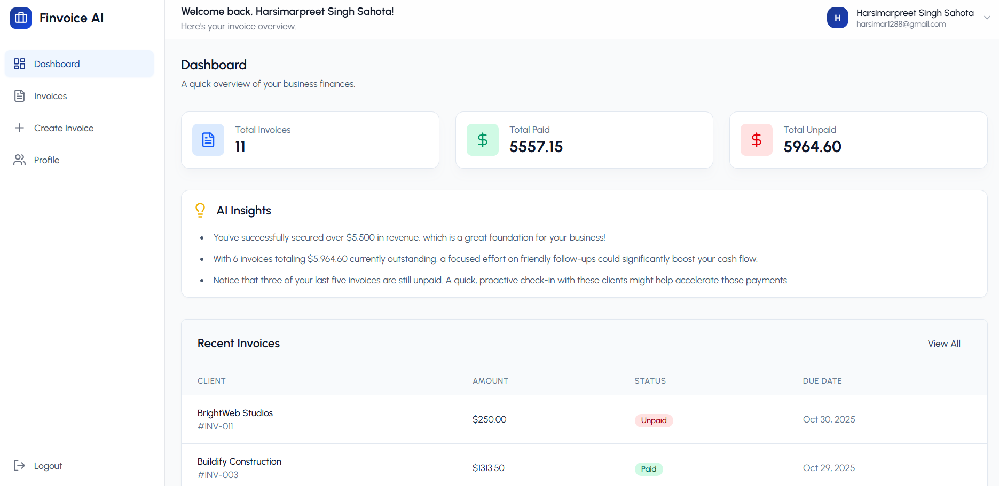
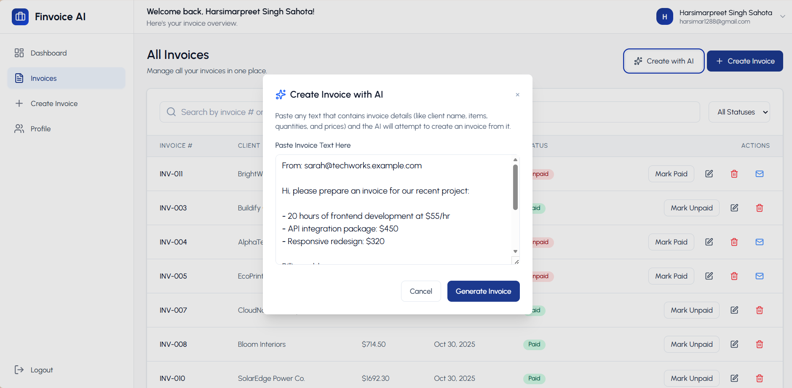
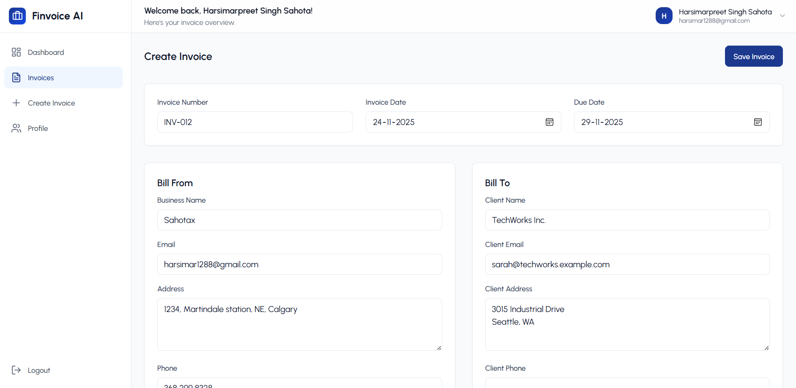
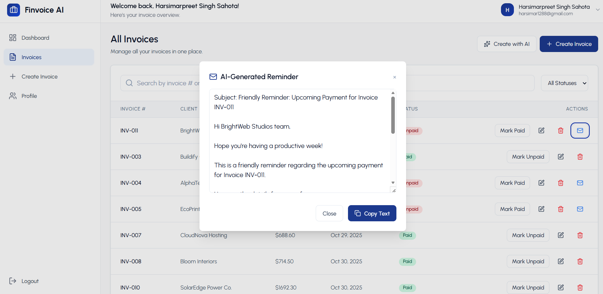
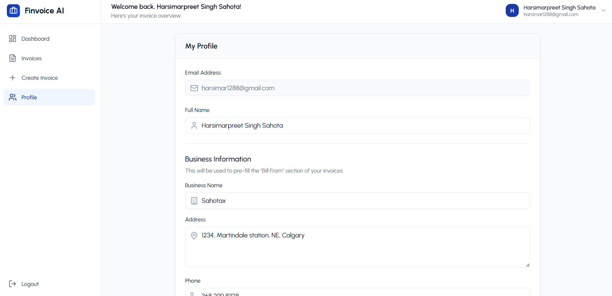
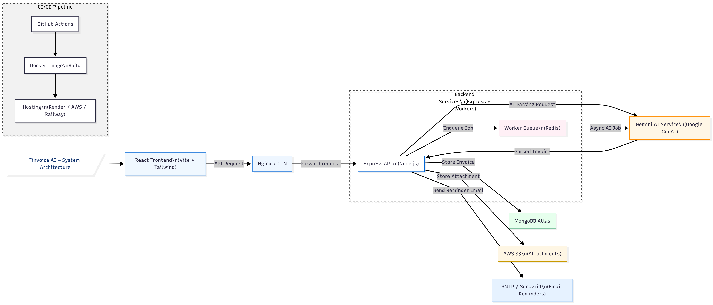

# 🧾 Finvoice AI
[](https://github.com/Harsimar-Sahota/Finvoice-AI/actions/workflows/ci.yml)

### AI-Powered Invoice Generator & Finance Assistant (MERN + Gemini AI)

**Finvoice AI** is a production-ready, full-stack SaaS app for automating invoicing and basic finance workflows.

It turns plain text (emails, chats, notes) into structured invoices, sends AI-generated payment reminders, and shows revenue insights on a clean dashboard — all powered by **Google Gemini**.

**Highlights**

-  Built with the **MERN stack** (MongoDB, Express, React, Node)
-  **AI features** using Google Gemini (`@google/generative-ai`)
-  **JWT authentication** + protected routes
-  **Dockerized** with `docker-compose`
-  **CI/CD** via GitHub Actions
-  **Unit tests** with Jest
---

## 🌐 Live Demo

🔗 **App URL:** **[https://www.finvoiceai.app](https://www.finvoiceai.app)**
🔐 **Test Credentials:**

```
email: Demo@FinvoiceAI.com
password: Demopass12$
```
---

## 🖼️ Screenshots

###  Dashboard Overview


###  Create Invoice


###  AI-Generated Invoice


###  AI Payment Reminder Email


###  Profile Settings


---

## 🧠 Overview
Finvoice AI is aimed at freelancers and small businesses who need simple but smart invoicing.

The app can:

Parse unstructured text into a structured invoice

Generate payment reminder emails with AI

Track paid / unpaid invoices and basic revenue stats

Manage user profile and business details

From a dev perspective, this project demonstrates:

Building a real SaaS-style app with authentication & dashboards

Integrating a modern AI API into an existing backend

Using Docker + CI/CD for repeatable deployments

Writing unit tests around core backend logic

---

## 🛠️ Tech Stack

| Layer                  | Technology                         |
| ---------------------- | ---------------------------------- |
| **Frontend**           | React (Vite) + TailwindCSS + Axios |
| **Backend**            | Node.js + Express.js               |
| **Database**           | MongoDB Atlas                      |
| **AI Engine**          | Google Gemini API (@google/genai)  |
| **Authentication**     | JWT + bcryptjs                     |
| **Containerization**   | Docker                             |
| **CI/CD**              | GitHub Actions                     |
| **Testing**            | Jest                               |
| **Environment Config** | dotenv                             |

---

## ✨ Features

### 🔐 Authentication

* Secure signup/login using JWT
* Password hashing with bcrypt

### 🧾 Invoice Management

* Create, edit, delete, and filter invoices
* Auto-filled business details
* Export invoices as PDF

### 🧠 AI-Powered Tools

* **AI Invoice Generator:** Convert text → invoice instantly
* **AI Reminder Emails:** Generate payment reminders
* **AI Dashboard:** Summarize income, due payments, and insights

### 📱 Modern UI

* Responsive React + Tailwind design
* Dark mode ready

---

## 🏗️ Architecture Diagram


---

## 📂 Project Structure

```
Finvoice-AI/
│
├── backend/
│   ├── config/
│   │   └── db.js
│   ├── controllers/
│   │   ├── aiController.js
│   │   ├── authController.js
│   │   └── invoiceController.js
│   ├── middlewares/
│   │   └── authMiddleware.js
│   ├── models/
│   │   ├── Invoice.js
│   │   └── User.js
│   ├── routes/
│   │   ├── aiRoutes.js
│   │   ├── authRoutes.js
│   │   └── invoiceRoutes.js
│   ├── tests/
│   │   └── auth.test.js
│   ├── server.js
│   └── .env.example
│
├── frontend/
│   └── invoice-generator/
│       ├── src/
│       │   ├── assets/
│       │   ├── components/
│       │   ├── context/
│       │   ├── pages/
│       │   ├── utils/
│       │   ├── test/
│       │   │   └── fileMock.js
│       │   ├── App.jsx
│       │   ├── index.css
│       │   └── main.jsx
│       ├── public/
│       ├── screenshots/
│       ├── vite.config.js
│       └── jest.config.cjs
│
├── docs/
│   └── architecture.png
│
├── screenshots/
│   ├── dashboard.png
│   ├── create-invoice.png
│   ├── ai-generated.png
│   ├── reminder-email.png
│   └── profile-settings.png
│
├── docker-compose.yml
├── .github/workflows/        # CI/CD pipelines
├── .env.example              # root example env, if used
└── README.md

```

---

## ⚙️ Installation & Setup

### 🧩 Clone Repository

```bash
git clone https://github.com/Harsimar-Sahota/Finvoice-AI.git
cd Finvoice-AI
```

---

### 🖥️ Backend Setup

```bash
cd backend
npm install
```

Create a `.env` file inside the **backend** folder:

```env
MONGO_URI=your_mongodb_connection_string
JWT_SECRET=your_secret_key
GEMINI_API_KEY=your_gemini_api_key
GEMINI_MODEL=models/gemini-2.5-flash
PORT=8000
```

Run backend:

```bash
npm run dev
```

---

### 💻 Frontend Setup

```bash
cd ../frontend
npm install
npm run dev
```

Visit:
👉 [http://localhost:5173](http://localhost:5173)

---

## 🐳 Docker Setup

To run everything with Docker:

docker-compose up --build


The stack exposes:

Frontend → http://localhost:5173

Backend API → http://localhost:8000/api

Make sure the ports in docker-compose.yml match these values.
---

## ## 🔄 Continuous Integration / Deployment (CI/CD)

This project uses **GitHub Actions** to automate quality checks and deployments:

-  Run builds and **Jest tests** on every push and pull request  
-  Build **Docker images** for consistent environments  
-  Deploy the frontend to **Vercel** and backend to **Render**  
-  Block merges if tests or builds fail  

CI status is displayed via the badge at the top of this README.


##   Testing (Jest)

Finvoice AI uses **Jest** for unit testing.

### 📋 Coverage

* Auth API tests (login/signup)
* AI generation tests (mocked Gemini API)
* Invoice CRUD logic
* Utility functions (date, parsing)

Run tests:

```bash
cd backend
npm run test
```

Optional:

```bash
npm run test:watch
```

---

## 📈 Scaling Plan

The following strategies outline how Finvoice AI can scale as user traffic and AI usage grow:

| # | Strategy                                  | Purpose                |
| - | ----------------------------------------- | ---------------------- |
| 1 | Add **rate limiting** on AI endpoints     | Prevent API abuse      |
| 2 | Use **Redis queues** for heavy AI tasks   | Handle concurrency     |
| 3 | Implement **MongoDB indexing**            | Faster invoice queries |
| 4 | Serve frontend via **CDN**                | Faster global load     |
| 5 | Store files in **AWS S3**                 | Offload from server    |
| 6 | Use **Redis caching** for dashboard stats | Improve performance    |

---

## 🔐 Security Practices

* JWT-based authentication
* Password hashing (bcrypt)
* Input validation (Zod/Joi)
* Rate limiting on AI routes
* CORS + Helmet middleware
* Environment secrets via `.env`
* No secrets committed to repo

---

## 💡 Inspiration

> Inspired by **Y Combinator’s RFS**: *Vertical SaaS & AI Tools for Small Businesses*

This project aligns with Y Combinator’s mission of building AI tools that automate real business workflows.

---

## 👨‍💻 Author

**Harsimar Preet Singh Sahota**
Full Stack Developer — MERN + AI

🌐 [GitHub](https://github.com/Harsimar-Sahota)
💼 [LinkedIn](https://linkedin.com/in/Harsimar-Sahota)

---

## 🪪 License

This project is open-source under the **MIT License**.
---
